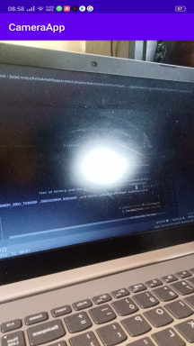

#CameraX in android using java
CameraX is an addition to Android Jetpack that makes it easier to add camera capabilities to your app. The library provides a number of compatibility fixes and workarounds to help make the developer experience consistent across many devices. \
In this app you can switch camera very frequently. \
You can abel to capture image and store internal storage. (Check commit message) \

