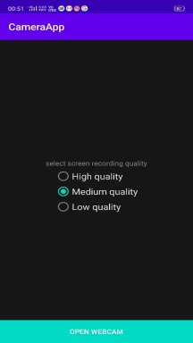
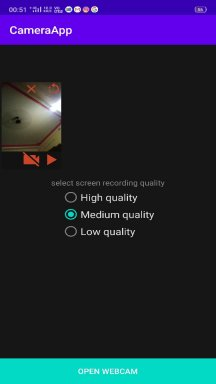
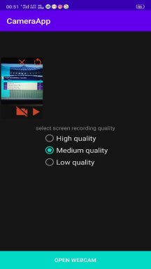
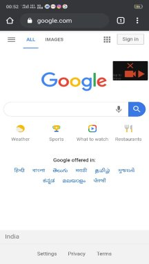

# Easy Screen Recorder
Description:\
The android application was developed using Java and Kotlin. Using the application the user can record his\
screen low, medium and high quality. CameraX and floating layout features are included in this app.\
While users run the application a floating window will open. Users can start and stop recording through the\
floating window. Floating window has an open webcam button to open or close the camera. The camera also\
switches front and back both directions. The app requires special permission “Drawing over other apps”.\
The included CameraX is a Jetpack support library It provides a consistent and easy-to-use API surface\
that works across most Android devices, with backward-compatibility to Android 5.0 (API level 21).\

